<div align="center">



<br>

<a href="https://github.com/reichertdavid?tab=repositories"></a>


<!-- optional extras — drop your URLs in and delete the comment markers
<a href="https://linkedin.com/in/YOUR-HANDLE"></a>
<a href="https://YOUR-SITE.tech"></a>
-->



</div>

<h3 align="center"><samp>◆&nbsp;&nbsp;w h o a m i&nbsp;&nbsp;◆</samp></h3>

```ts
const david = {
  age:      23,
  role:     "Software Engineer · Fullstack",
  writing:  "11 years",   // started at 12 and never really stopped
  shipping: "9 years",    // teenage side job → part-time helper → full-time
  stack:    "a little bit of all of it",

  beliefs: [
    "the frontend and the backend are the same problem wearing different hats",
    "boring technology applied well beats clever technology applied often",
    "if it isn't deployed, it isn't done",
    "the best abstraction is the one you didn't need to write",
  ],

  currently: "shipping",
} as const satisfies Engineer;
```

<div align="center">


<h3><samp>◆&nbsp;&nbsp;t h e&nbsp; s t a c k&nbsp;&nbsp;◆</samp></h3>



<sub><i>Nine years in, the honest answer to "what's your stack?" is <b>"what does this actually need?"</b><br>Languages are vocabulary. The interesting part was never the syntax.</i></sub>


<h3><samp>◆&nbsp;&nbsp;g i t&nbsp; l o g&nbsp; - - r e v e r s e&nbsp;&nbsp;◆</samp></h3>




<h3><samp>◆&nbsp;&nbsp;t e l e m e t r y&nbsp;&nbsp;◆</samp></h3>


<br>


<br><br>


<h3><samp>◆&nbsp;&nbsp;t h e&nbsp; s n a k e&nbsp; e a t s&nbsp; t h e&nbsp; y e a r&nbsp;&nbsp;◆</samp></h3>

<picture>
  <source media="(prefers-color-scheme: dark)" srcset="https://raw.githubusercontent.com/reichertdavid/reichertdavid/output/snake-dark.svg" />
  <source media="(prefers-color-scheme: light)" srcset="https://raw.githubusercontent.com/reichertdavid/reichertdavid/output/snake-light.svg" />
  
</picture>

</div>


<h3 align="center"><samp>◆&nbsp;&nbsp;t h e&nbsp; l o n g e r&nbsp; v e r s i o n&nbsp;&nbsp;◆</samp></h3>

<details>
<summary><samp><b>&nbsp;▸&nbsp; How I got here</b></samp></summary>
<br>

I wrote my first line of code at **12**, mostly because I wanted to change something in a program someone else had made and nobody would do it for me. That turned out to be a durable motivation.

By **14** somebody was paying for it. It started as the kind of job a teenager gets — small fixes, small sites, "can you make this work" — and slowly turned into part-time work with real deadlines and real users, and then into doing this full-time.

Nine professional years starting that young means I learned the unglamorous half of the job early: that the code is the easy part, that requirements are always a translation problem, and that the person who has to maintain this in two years is usually me.

</details>

<details>
<summary><samp><b>&nbsp;▸&nbsp; How I pick a stack</b></samp></summary>
<br>

| Question | Why it comes first |
| :-- | :-- |
| Who maintains this in two years? | Decides "clever" vs. "obvious" more than anything else |
| What is the actual constraint? | Latency, team size, budget, and deadlines pick tools — trends don't |
| What is already here? | The cheapest technology is the one the team already runs |
| What breaks at 10×? | Cheap to design for now, expensive to retrofit later |
| Can I delete it later? | Anything I can't remove, I have to be right about the first time |

I'm deliberately not loyal to a language. I've shipped frontends, backends, glue, infra and the occasional thing nobody wanted to own — and the pattern is always the same: understand the problem properly, then choose the least surprising tool that solves it.

</details>

<details>
<summary><samp><b>&nbsp;▸&nbsp; How this README is built</b></samp></summary>
<br>

No screenshot, no template, no image host — every banner on this page is a hand-authored SVG with CSS keyframe animations, generated by a script in this repo:

```bash
python3 tools/build_assets.py     # → assets/*.svg
```

* Pure SVG + CSS, no JavaScript — so it animates inside GitHub's `` sandbox
* Every text run uses `textLength`, so the layout is identical whether or not you have the fonts
* The frosted-glass look is layered blurred gradients + a grain filter, not a screenshot
* Colours, chip lists and timeline milestones all live at the top of `build_assets.py`

</details>

<div align="center">

<br>



</div>
